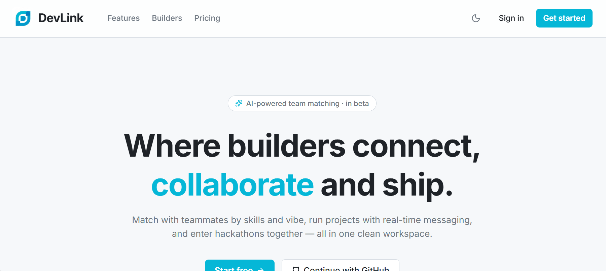
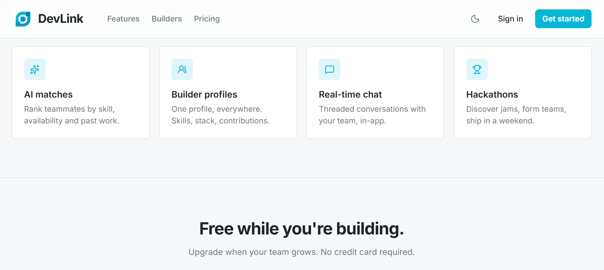
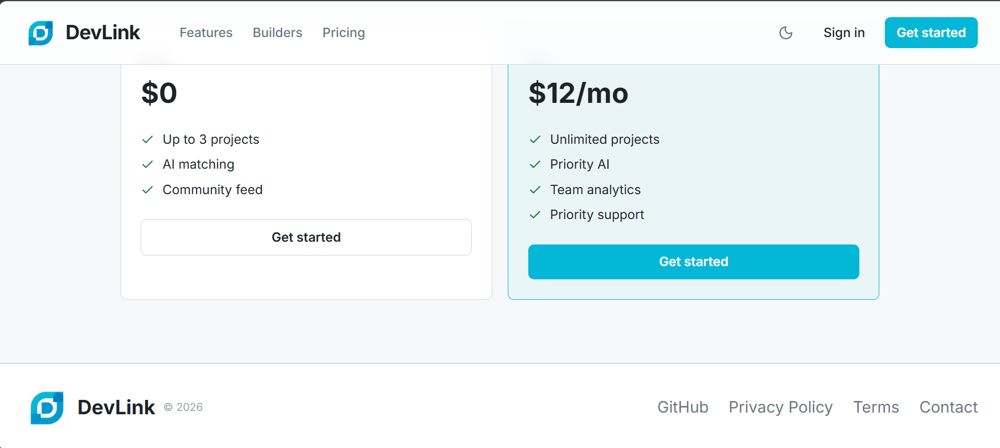
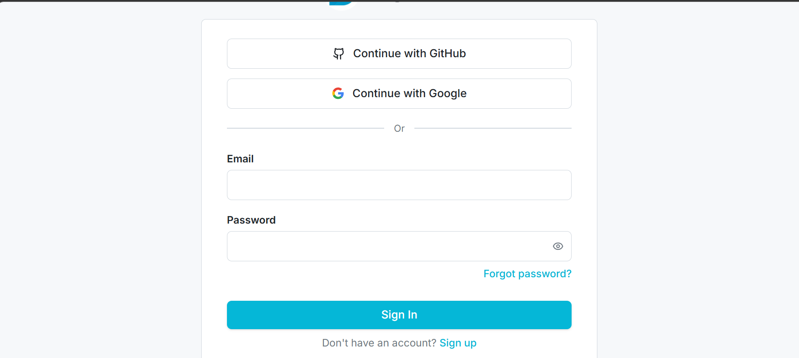
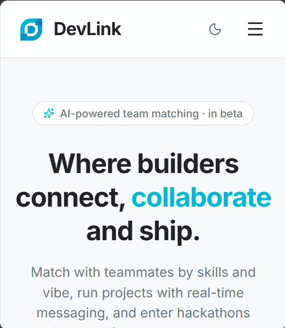
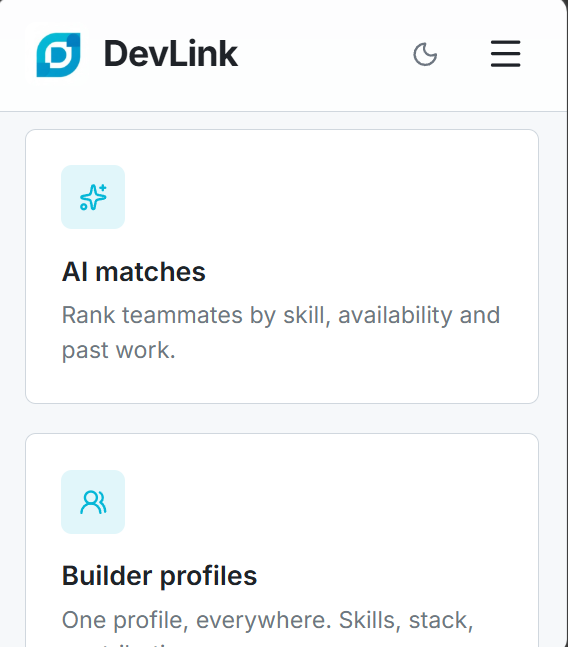

<p align="center">
  
</p>

<h2 align="center">DevLink</h2>

<p align="center">Open-source platform for developer collaboration, project discovery, and team formation.</p>

<p align="center">
  <a href="https://github.com/nensii21/devlink/actions"></a>
  <a href="https://github.com/nensii21/devlink/releases"></a>
  <a href="https://github.com/nensii21/devlink/blob/main/LICENSE"></a>
  <a href="https://hub.docker.com"></a>
  <a href="https://react.dev"></a>
  <a href="https://fastapi.tiangolo.com"></a>
  <a href="https://github.com/nensii21/devlink/stargazers"></a>
  <a href="https://github.com/nensii21/devlink/graphs/contributors"></a>
</p>

---

## Table of Contents

- [Overview](#overview)
- [Screenshots](#screenshots)
- [Features](#features)
- [Tech Stack](#tech-stack)
- [Getting Started](#getting-started)
- [Environment Variables](#environment-variables)
- [Available Scripts](#available-scripts)
- [Project Structure](#project-structure)
- [Deployment](#deployment)
- [Roadmap](#roadmap)
- [Contributing](#contributing)
- [Changelog](#changelog)
- [Acknowledgements](#acknowledgements)
- [License](#license)

---

## Overview

DevLink is an open-source developer collaboration platform. Developers can create profiles, post and discover projects, apply to join teams, communicate in real time via WebSockets, follow contributors, and link their GitHub repositories.

> **Status:** Active development. Open to contributors. See [CONTRIBUTING.md](CONTRIBUTING.md) to get started.

**Documentation:**
[Architecture](docs/architecture.md) · [API Reference](docs/api.md) · [Development Setup](docs/development.md) · [Deployment Guide](docs/deployment.md) · [Coding Standards](docs/coding-standards.md) · [WebSockets](docs/WEBSOCKETS.md)

---

## 📸 Screenshots

### Desktop

| Dashboard | Features |
|-----------|-----------|
|  |  |

**Dashboard** – Main dashboard displaying the application's overview.

**Features** – Highlights the core functionality available to users.

| Pricing | Login |
|---------|--------|
|  |  |

**Pricing** – Displays available pricing plans.

**Login** – User authentication page.

---

### Mobile

| Dashboard | Features |
|-----------|-----------|
|  |  |

**Mobile Dashboard** – Responsive dashboard view.

**Mobile Features** – Responsive features page.
M


- React
- TypeScript
- Tailwind CSS
- React Router
- React Query

## Features

| Feature | Description |
| :--- | :--- |
| Developer Profiles | Portfolio pages with skills, GitHub repository links, experience, and social links |
| Project Marketplace | Browse, create, and apply to open-source projects and team openings |
| Team Applications | Role-based application submission with status tracking and owner review |
| Real-Time Messaging | WebSocket direct messaging with conversation threads and presence indicators |
| Notifications | Real-time event notifications for applications, messages, and activity |
| Builder Activity Feed | Community updates, project announcements, and contributor flares |
| Followers & Activity | Follow developers and track their public activity feed |
| Search & Discovery | Full-text search across developers, projects, issues, and skills |
| Saved Searches | Store and manage custom search queries with alert support |
| Bookmarks | Save projects to personal bookmark collections |
| Project Issues | Issue tracking linked to projects |
| Repository Linking | Connect GitHub repositories to project profiles with quality scoring |
| Organizations | Create and manage organization workspaces |
| Contributor Matching | Match contributors to projects based on skills and availability |
| Project Recommendations | Recommend relevant projects to developers based on their profile |

---

## Tech Stack

### Frontend

| Technology | Purpose |
| :--- | :--- |
| React 19 | UI library |
| TypeScript 5.8 | Type safety |
| Vite 8 | Build tool and development server |
| Tailwind CSS v4 | Styling |
| TanStack Router v1 | Client-side routing |
| TanStack Query v5 | Server state and data fetching |
| Framer Motion | Animations |

### Backend

| Technology | Purpose |
| :--- | :--- |
| Python 3.11+ | Runtime |
| FastAPI | REST API framework |
| Pydantic v2 | Request validation and serialization |
| SQLAlchemy 2.0 | ORM and async query engine |
| Asyncpg | Async PostgreSQL driver |
| Alembic | Database schema migrations |

### Database & Infrastructure

| Technology | Purpose |
| :--- | :--- |
| PostgreSQL 15+ | Primary relational database |
| Redis 7+ | Caching and Pub/Sub broker |
| Celery | Asynchronous task processing |

### DevOps

| Technology | Purpose |
| :--- | :--- |
| Docker & Docker Compose | Containerization and local environment |
| DevContainers | VS Code and GitHub Codespaces support |
| GitHub Actions | CI/CD pipelines |

---

## Getting Started

### Prerequisites

- Node.js 20+
- Python 3.11+
- Docker & Docker Compose *(recommended)*
- PostgreSQL 15+ and Redis 7+ *(if running without Docker)*

### Option 1 — Docker Compose (Recommended)

```bash
git clone https://github.com/nensii21/devlink.git
cd devlink
docker-compose -f docker-compose.dev.yml up --build
```

| Service | URL |
| :--- | :--- |
| Frontend | `http://localhost:5173` |
| Backend API | `http://localhost:8000` |
| Swagger UI | `http://localhost:8000/docs` |

### Option 2 — Manual Setup

```bash
git clone https://github.com/nensii21/devlink.git
cd devlink
```

**Backend:**

```bash
cd backend
python -m venv venv
source venv/bin/activate      # Windows: venv\Scripts\activate
pip install -r requirements.txt
cp .env.example .env          # fill in required values
alembic upgrade head
uvicorn app.main:app --reload
```

**Frontend:**

```bash
cd frontend
npm install
cp .env.example .env          # fill in required values
npm run dev
```

### DevContainers

Open in VS Code and run **Remote-Containers: Reopen in Container**, or launch in [GitHub Codespaces](https://codespaces.new/nensii21/devlink). Dependencies and port forwarding are configured automatically via `.devcontainer/`.

---

## Environment Variables

| Module         | Versioned Endpoint (`v1`) | Legacy Endpoint (`/api`) |
| -------------- | ------------------------- | ------------------------ |
| Authentication | `/api/v1/auth`            | `/api/auth`              |
| Users          | `/api/v1/users`           | `/api/users`             |
| Projects       | `/api/v1/projects`        | `/api/projects`          |
| Applications   | `/api/v1/applications`    | `/api/applications`      |
| Messaging      | `/api/v1/messages`        | `/api/messages`          |
| Notifications  | `/api/v1/notifications`   | `/api/notifications`     |

> DevLink uses URL Path Versioning (`/api/v1`). Legacy unversioned `/api/` endpoints are maintained for backward compatibility. See [API Versioning & Migration Strategy](file:///Users/nayanraj/devlink/docs/api_versioning_and_migration.md).

Swagger UI:

```
http://localhost:8000/docs
```
### Backend (`backend/.env`)

| Variable | Required | Description |
| :--- | :---: | :--- |
| `DATABASE_URL` | Yes | PostgreSQL async connection string |
| `REDIS_URL` | Yes | Redis connection URI |
| `SECRET_KEY` | Yes | Secret for JWT token signing |
| `ENVIRONMENT` | No | `development`, `staging`, or `production` |
| `GITHUB_CLIENT_ID` | No | GitHub OAuth App client ID |
| `GITHUB_CLIENT_SECRET` | No | GitHub OAuth App client secret |
| `OPENAI_API_KEY` | No | OpenAI key for profile summary and recommendations |
| `CORS_ORIGINS` | No | Allowed CORS origins (JSON array) |

### Frontend (`frontend/.env`)

| Variable | Required | Description |
| :--- | :---: | :--- |
| `VITE_API_URL` | Yes | Backend API base URL |
| `VITE_APP_NAME` | No | Application display name |

---

## Available Scripts

### Frontend

```bash
npm run dev        # Start local development server (HMR)
npm run build      # Compile production bundle
npm run test       # Run unit tests (Vitest)
npm run lint       # Static analysis with ESLint
npm run format     # Format with Prettier
npm run typecheck  # TypeScript type check (no emit)
```

### Backend

```bash
uvicorn app.main:app --reload             # Start development server
pytest                                    # Run test suite
pytest --cov=app --cov-report=term        # Run with coverage report
alembic upgrade head                      # Apply pending migrations
alembic revision --autogenerate -m "msg"  # Generate new migration
```

---

## Project Structure

```
devlink/
├── .devcontainer/          # DevContainer configuration
├── .github/                # GitHub Actions workflows and issue templates
├── backend/
│   ├── alembic/            # Database migration scripts
│   ├── app/
│   │   ├── core/           # Config, security, events, cache
│   │   ├── middleware/     # Rate limiting, security headers, request ID
│   │   ├── models/         # SQLAlchemy ORM models
│   │   ├── routers/        # API route handlers
│   │   ├── schemas/        # Pydantic validation schemas
│   │   ├── services/       # Business logic layer
│   │   └── main.py         # FastAPI application entrypoint
│   ├── tests/              # Pytest test suite
│   ├── Dockerfile
│   └── requirements.txt
├── frontend/
│   ├── src/
│   │   ├── api/            # HTTP client modules
│   │   ├── components/     # UI component library
│   │   ├── hooks/          # Custom React hooks
│   │   └── routes/         # Page routes (TanStack Router)
│   ├── Dockerfile
│   └── package.json
├── docs/                   # Documentation files
│   ├── screenshots/        # Application screenshots
│   ├── api.md
│   ├── architecture.md
│   ├── coding-standards.md
│   ├── deployment.md
│   └── development.md
├── docker-compose.dev.yml
├── CONTRIBUTING.md
├── CHANGELOG.md
├── CODE_OF_CONDUCT.md
└── README.md
```

---

## Deployment

Full deployment instructions are in [docs/deployment.md](docs/deployment.md).

**Frontend** — Deploy the `frontend/` build to [Vercel](https://vercel.com), [Netlify](https://netlify.com), or [Cloudflare Pages](https://pages.cloudflare.com).

**Backend** — Deploy `backend/Dockerfile` to [Render](https://render.com), [Railway](https://railway.app), or AWS ECS.

**Database** — Use a managed PostgreSQL service (AWS RDS, Supabase) and managed Redis (Upstash, Redis Cloud).

---

## Roadmap

| Version | Planned Features | Status |
| :--- | :--- | :--- |
| `v0.1.0` | User authentication, developer profiles, project marketplace, GitHub OAuth | Completed |
| `v0.2.0` | WebSocket messaging, team applications, notifications, repository linking | Completed |
| `v0.3.0` | Builder flares, saved searches, bookmark collections, contributor matching, organizations | In Progress |
| `v0.4.0` | Project issue tracking, project analytics, extended search filters | Planned |
| `v1.0.0` | Mobile application, public REST API, advanced integrations | Planned |

---

## Contributing

Contributions are welcome. Please read [CONTRIBUTING.md](CONTRIBUTING.md) and [CODE_OF_CONDUCT.md](CODE_OF_CONDUCT.md) before submitting a pull request.

```bash
# Create a feature branch
git checkout -b feat/your-feature

# Commit using Conventional Commits
git commit -m "feat(scope): short description"

# Push and open a pull request
git push origin feat/your-feature
```

---

## Changelog

See [CHANGELOG.md](CHANGELOG.md) for a full list of changes across releases.

---

## Acknowledgements

- [FastAPI](https://fastapi.tiangolo.com) — backend API framework
- [React](https://react.dev) — frontend UI library
- [TanStack](https://tanstack.com) — routing and data fetching
- [Radix UI](https://www.radix-ui.com) — accessible UI primitives
- [SQLAlchemy](https://www.sqlalchemy.org) — async ORM
- All contributors and [ECSoc 2026](https://github.com/nensii21/devlink/graphs/contributors) participants

---

## License
IT License — see [LICENSE](LICENSE) for details.

## ⭐ If you like DevLink, consider giving the repository a star!

Made by developers, for developers.

Building the future of developer collaboration.

</p>
...

